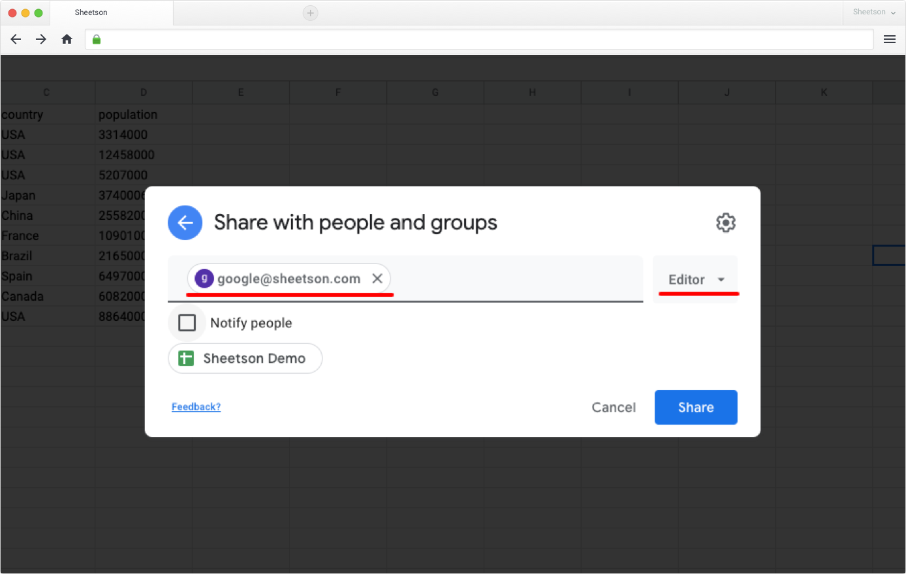
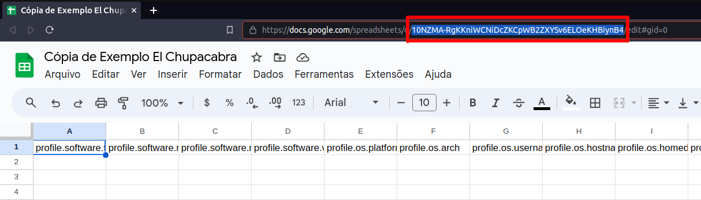
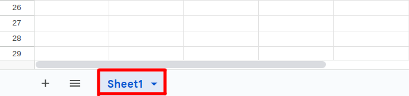
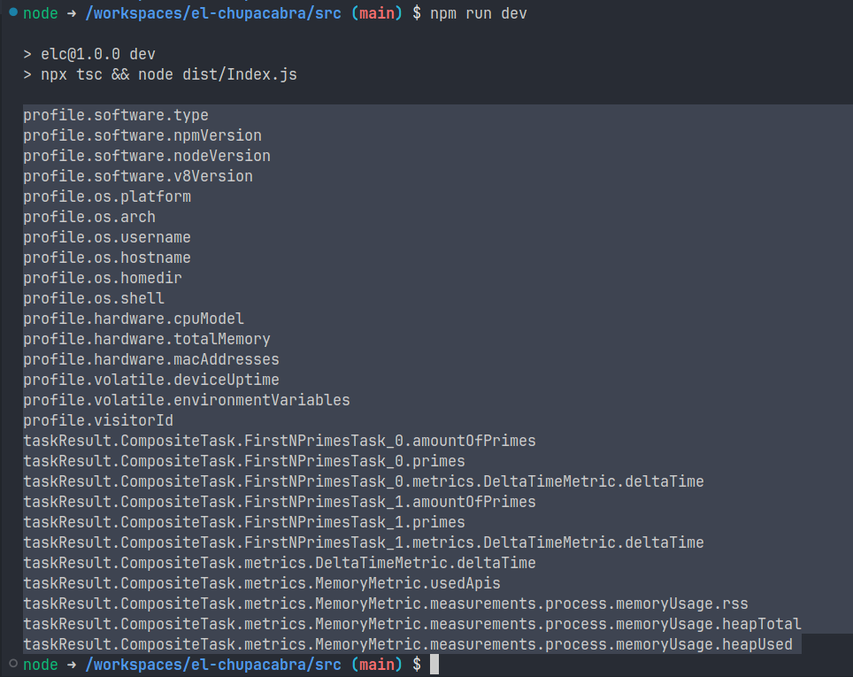
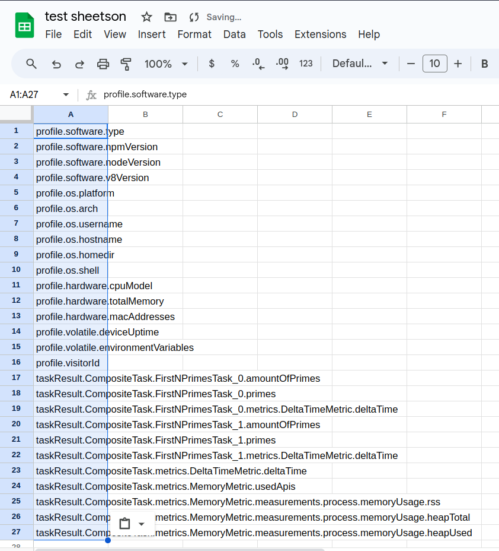
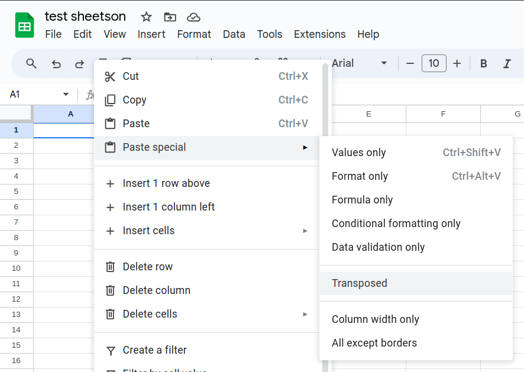
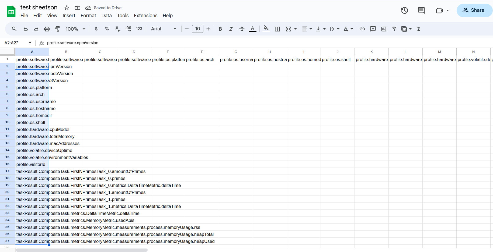
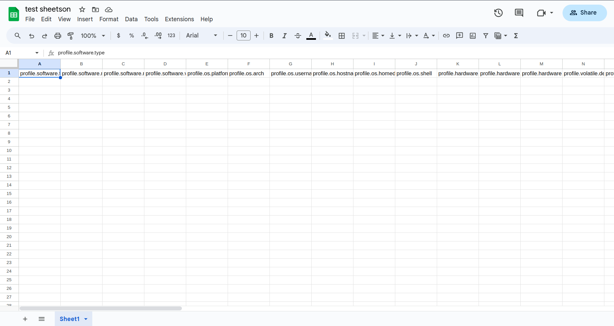

# El Chupacabra
Um framework para testes com voluntários de provas de conceito voltado para aplicações web do lado cliente.

## Demo TLDR
Como executar em poucos passos a demonstração do framework.

1. Certifique-se de ter instalado em sua máquina o [Node.js](https://nodejs.org/en) e o [npm](https://www.npmjs.com).
2. Dentro do diretório `src`, execute o comando abaixo para instalar as dependências.
    ```bash
    npm install
    ```
3. Ainda dentro de `src`, execute o comando abaixo para executar o compilador do typescript e
executar a aplicação no seu terminal usando o Node.js.
    ```bash
    npm run dev
    ```
4. Veja a saída da demonstração no arquivo `/src/result.json`.


## Colete dados em uma planilha do Google Sheets
Para isso usamos o [Sheetson](https://sheetson.com/), o qual é uma API que simplifica a interação com dados do Google Sheets. Ou seja, o meio pelo qual os dados de execução do El Chupacabra são coletados para uma planilha no Google Sheets.

1. Se autentique no site do [Sheetson](https://sheetson.com/) usando uma conta Google e acesse o [console](https://sheetson.com/console).
2. Crie uma nova planilha no [Google Sheets](https://docs.google.com/spreadsheets).
3. Compartilhe essa planilha com o e-mail do Sheetson `google@sheetson.com`.
    
4. Obtenha o ID da planilha na barra de endereço do navegador.
    
5. Obtenha o nome da aba da sua planilha onde os dados serão inseridos.
    
6. No console do Sheetson, obtenha a sua API Key.
7. Abra o arquivo `src/Index.ts`, comente a linha:
    ```ts
    const persister = new JsonFilePersister("./result.json") as IPersister
    ```
    E, descomente as linhas:
    ```ts
    const persister = new SheetsonPersister(
        "NOME_DA_ABA_DA_SUA_PLANILHA",
        "API_KEY",
        "ID_DA_PLANILHA"
    ) as IPersister
    ```
8. Substitua os templates `NOME_DA_ABA_DA_SUA_PLANILHA`, `API_KEY` e `ID_DA_PLANILHA`, pelos respectivos dados que obtivemos anteriormente.
9. Com tudo isso feito, agora precisamos obter as colunas da nossa planilha. Para isso, execute a aplicação de dentro da pasta `src`:
    ```bash
    npm run dev
    ```
10. No seu terminal, foram imprimidas as colunas que devem estar presentes na planilha do Google Sheets.
    
11. [Opcional] Este passo guia como inserir as colunas na planilha de um modo mais fácil, mas sinta-se a vontade para inserir-lás na tabela como desejar.
    1. Copie o nome das colunas no terminal.
    2. Selecione a célula A1 na planilha e cole `Ctrl + V`.
        
    3. Selecione todas as células com algum valor e copie `Ctrl + C`.
    4. Selecione novamente a célula A1 e clique com o botão direito.
    5. Dentro do submenu `Paste special`, selecione `Transposed`.
        
    6. Limpe todas as células preenchidas da linha 2 para baixo.
        
12. Com o nome de cada coluna preenchida e sua planilha está parecida com essa abaixo:
    
13. Pronto, agora cada execução do El Chupacabra deve enviar as informações para a sua planilha no Google Sheets.

# Documentação

## Diagramas
Os diagramas em `/docs` foram escritos usando [Mermaid syntax](https://mermaid.js.org/) os quais podem ser 
visualizados no vscode com o uso da extensão [Markdown Preview Mermaid Support](https://marketplace.visualstudio.com/items?itemName=bierner.markdown-mermaid), além disso, para syntax highlighting a extensão 
[Mermaid Markdown Syntax Highlighting](https://marketplace.visualstudio.com/items?itemName=bpruitt-goddard.mermaid-markdown-syntax-highlighting) também é necessária.


## Trabalho com LaTeX
Para conseguir trabalhar com LaTeX no vscode é necessário instalar a extensão [LaTeX Workshop](https://marketplace.visualstudio.com/items?itemName=James-Yu.latex-workshop) e configurar um compilador.

### Configurando LaTeX localmente usando Docker
1. Instale o Docker e configure seu usuário como membro do grupo `docker` para que não seja necessário utilizar sudo.
2. Obtenha a imagem do LaTeX - obs: ela possui mais de 2GB de tamanho.
```bash
docker pull tianon/latex
```
3. Configure a extensão `LaTeX Workshop` para usar a imagem Docker.
    - Abra a `Command Pallet`(Ctrl + Shift + p) do vscode e busque por `Open Settings (JSON)`.
    - Adicione as seguintes configurações ao final do arquivo:
    ```json
    "latex-workshop.view.pdf.viewer": "tab",
    "latex-workshop.docker.enabled": true,
    "latex-workshop.latex.outDir": "./out",
    "latex-workshop.synctex.afterBuild.enabled": true,
    "latex-workshop.docker.image.latex": "tianon/latex",
    ```

## Compilando Projeto Mock
```bash
tsc -p ./tsconfig.json
```
