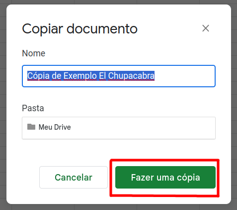

# El Chupacabra Framework :goat:


Framework para testes remotos de provas de conceito voltado para aplicações web do lado cliente.

## :owl: Índice
1. Demo TL;DR
2. Coleta de Dados via Google Sheets
3. Exemplo de Uso

## :japanese_ogre: Demo TL;DR
Como executar em poucos passos a demonstração do framework.

1. Certifique-se de ter instalado em sua máquina o [Node.js](https://nodejs.org/en) e o [npm](https://www.npmjs.com).

2. Dentro do diretório `src`, execute o comando abaixo para instalar as dependências.

    ```bash
    npm install
    ```
3. Ainda dentro de `src`, execute o comando abaixo para executar a demo usando o Node.js.

    ```bash
    npm run demo
    ```
4. Veja a saída da demonstração no arquivo `/src/result.json`.


## :rocket: Coleta de Dados via Google Sheets

Uma das principais vantagens de usar o framework El Chupacabra é sua capacidade de realizar a coleta de métricas por meio do Google Sheets com esforço mínimo. Deste modo, a coleta de métricas em diferentes ambientes se torna simples, pois os dados de todas as execuções são centralizados em uma única planilha. Além disso, a análise dos dados também é facilitada, por contar com todo o aparato do próprio Google Sheets.

### Configurando planilha para receber os dados

1. Acesse a planilha: [Exemplo El Chupacabra](https://docs.google.com/spreadsheets).

2. Clique em `Arquivo` do menu superior e selecione a opção `Fazer uma cópia`.

    

3. Clique no botão `Fazer uma cópia`.


    

> Após criar a planilha, precisamos obter algumas informações dela para usarmos mais a frente Recomendamos que as guarde em algum editor de texto, como um bloco de notas ou gedit.

4. Obtenha o ID da planilha na barra de endereço do navegador.

    

5. Obtenha o nome da aba da sua planilha onde os dados serão inseridos.

    

### Configurando API de recebimento dos dados

Para isso usamos o [Sheetson](https://sheetson.com/), o qual é uma API que simplifica a interação com o Google Sheets.

1. Se autentique no site do Sheetson usando uma conta Google e acesse o [console](https://sheetson.com/console).

2. Compartilhe a planilha criada anteriormente com o e-mail `google@sheetson.com`

    

3. No [console](https://sheetson.com/console), obtenha a sua API Key.

    

### Configurando a aplicação para enviar os dados para sua planilha

1. Abra o arquivo `src/Index.ts` e vá até o seguinte trecho:
    ```ts
    const persister = new SheetsonPersister(
        "NOME_DA_ABA_DA_SUA_PLANILHA",
        "API_KEY",
        "ID_DA_PLANILHA"
    ) as IPersister
    ```

2. Substitua os templates `NOME_DA_ABA_DA_SUA_PLANILHA`, `API_KEY` e `ID_DA_PLANILHA`, pelos respectivos dados que obtivemos anteriormente.

3. Com tudo isso feito, agora podemos rodar a aplicação. Para isso, execute a aplicação de dentro da pasta `src`:
    ```bash
    npm run dev
    ```

4. Veja o resultado da execução em sua planilha no Google Sheets.


## :duck: Exemplo de Uso

Neste exemplo, se considere um contribuidor do repositório [FirstNPrimes](https://github.com/El-Chupacabra-TCC/FirstNPrimes). O qual é um projeto de um [site](https://el-chupacabra-tcc.github.io/FirstNPrimes/) que calcula os primeiros `n` números primos dentro do próprio navegador. Ou seja, todo o processamento é no lado do cliente.

O maior desafio do projeto é oferecer o algoritmo mais eficiente possível para o cálculo dos números primos. Pois, quanto mais eficiente for o algoritmo, maior é a quantidade de números primos que o site é capaz de oferecer antes de haver lentidão na resposta.

No repositório, dentro da pasta `front/src/PrimeDiscoveryStrategies` podemos encontrar a interface dos objetos de cálculo de números primos (`IPrimeDiscoveryStrategy.ts`) e suas implementações. Logo, o objetivo atual é descobrir qual dessas abordagens é mais eficiente.

Para realizar essa comparação nós podemos usar o framework El Chupacabra :goat:.
