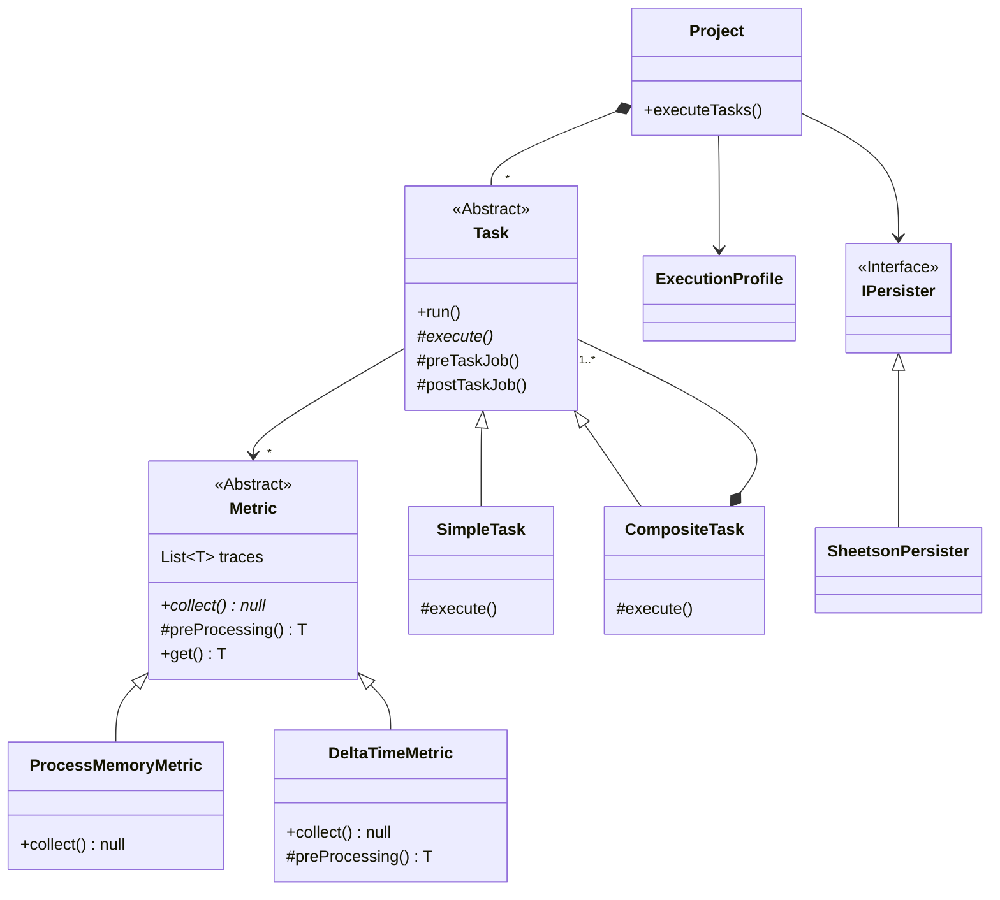

```mermaid
    classDiagram

        direction TB

        %% PROJECT LEVEL

        Project *-- "*" Task
        Project --> ExecutionProfile
        Project --> IPersister
        Task --> "*" Metric

        class Project {
            +executeTasks()
        }

        class ExecutionProfile {

        }


        %% Task family

        Task <|-- SimpleTask
        Task <|-- CompositeTask
        Task "1..*" --* CompositeTask

        class Task {
            <<Abstract>>
            +run()
            #execute()*
            #preTaskJob()
            #postTaskJob()
        }

        class SimpleTask {
            #execute()
        }

        class CompositeTask {
            #execute()
        }


        %% Metric family

        Metric <|-- ProcessMemoryMetric
        Metric <|-- DeltaTimeMetric

        class Metric {
            %% This should be a generic class where the type `T` will be the 
            %% primitive type of the metric.
            <<Abstract>>
            List~T~ traces
            +collect()* null
            #preProcessing() T
            +get() T
        }

        class ProcessMemoryMetric {
            %% Gets the current memory allocated by the process.
            +collect() null
        }

        class DeltaTimeMetric {
            %% Calculates the time between the last two collect method calls.
            +collect() null
            #preProcessing() T
        }


        %% PERSISTENCE MODULE

        IPersister <|-- SheetsonPersister

        class IPersister {
            <<Interface>>


        }

        class SheetsonPersister {

        }
```
