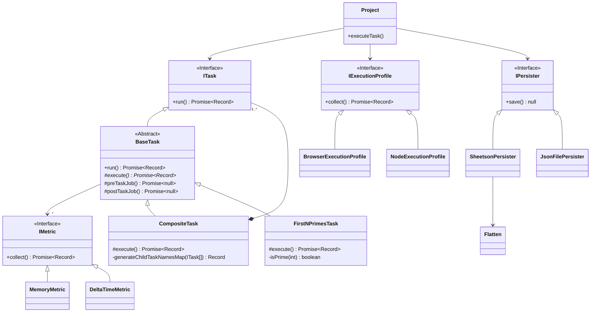

```mermaid
    classDiagram

        direction TB

        %% PROJECT LEVEL

        Project --> ITask
        Project --> IExecutionProfile
        Project --> IPersister

        class Project {
            +executeTask()
        }


        %% TASK MODULE

        ITask <|-- BaseTask
        BaseTask --> "*" IMetric
        BaseTask <|-- CompositeTask
        BaseTask <|-- FirstNPrimesTask
        ITask "1..*" --* CompositeTask

        class ITask {
            <<Interface>>
            +run() Promise~Record~
        }

        class BaseTask {
            <<Abstract>>
            +run() Promise~Record~
            #execute()* Promise~Record~
            #preTaskJob() Promise~null~
            #postTaskJob() Promise~null~
        }

        class CompositeTask {
            #execute() Promise~Record~
            -generateChildTaskNamesMap(ITask[]) Record
        }

        class FirstNPrimesTask {
            #execute() Promise~Record~
            -isPrime(int) boolean
        }


        %% EXECUTION PROFILE MODULE

        IExecutionProfile <|-- BrowserExecutionProfile
        IExecutionProfile <|-- NodeExecutionProfile

        class IExecutionProfile {
            <<Interface>>
            +collect() Promise~Record~
        }

        class BrowserExecutionProfile {

        }

        class NodeExecutionProfile {

        }


        %% METRICS MODULE

        IMetric <|-- MemoryMetric
        IMetric <|-- DeltaTimeMetric

        class IMetric {
            <<Interface>>
            +collect() Promise~Record~
        }

        class MemoryMetric {

        }

        class DeltaTimeMetric {

        }


        %% PERSISTENCE MODULE

        IPersister <|-- SheetsonPersister
        IPersister <|-- JsonFilePersister
        SheetsonPersister --> Flatten

        class IPersister {
            <<Interface>>
            +save() null
        }

        class SheetsonPersister {

        }

        class JsonFilePersister {

        }

        class Flatten {

        }
```
