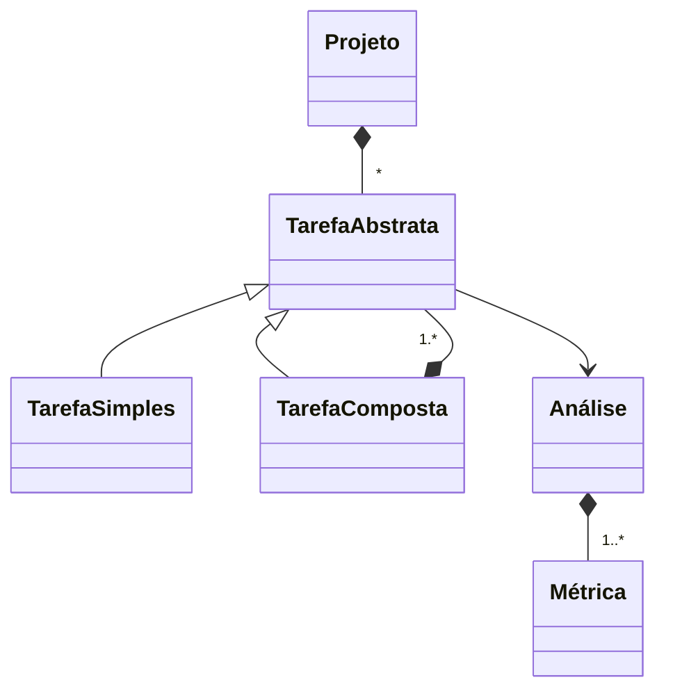

```mermaid
    classDiagram
        direction TB
    
        Projeto *-- "*" TarefaAbstrata
    
        class Projeto {
            %% Aplicação a qual o pesquisador está avaliando suas provas de conceito.
    
        }


        %% TAREFAS

        TarefaAbstrata <|-- TarefaSimples
        TarefaAbstrata <|-- TarefaComposta
        TarefaAbstrata "1.*" --* TarefaComposta
    
        class TarefaAbstrata {
            %% Roteiro de um processo ou procedimento sob avaliação.
        }

        class TarefaSimples {
            %% Implementação de um processo ou procedimento para avaliação.
        }

        class TarefaComposta {
            %% Uma tarefa a qual apenas contém outras tarefas.
        }


        %% ANÁLISES E MÉTRICAS

        TarefaAbstrata --> Análise
        Análise *-- "1..*" Métrica
    
        class Análise {
            %% Uma avaliação ou conjunto de métricas de uma tarefa.
        }
    
        class Métrica {
            %% Uma medida quantitativa de algum recurso computacional do cliente.
        }
```
